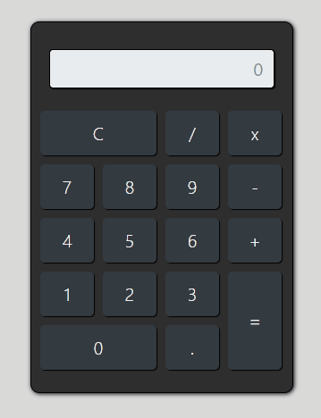

<h1 style='color:#c3c3c3'>Calculadora</h1>

A aplicação Calculadora permite resolver equações aritméticas com os operadores básicos

<h2 style='color:#c3c3c3'>As seguintes tecnologias foram utilizadas para a criação do projeto:</h2>

- HTML5

- Bootstrap

- Javascript
